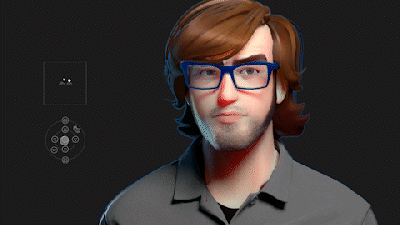

# ForticheFace

A digital avatar of myself. The project was originally called "Fortiche Face" because I wanted to try and reverse engineer the aesthetic Fortiche studio achieved in their League of Legends work.
The project drifted very significantly from that starting point.

